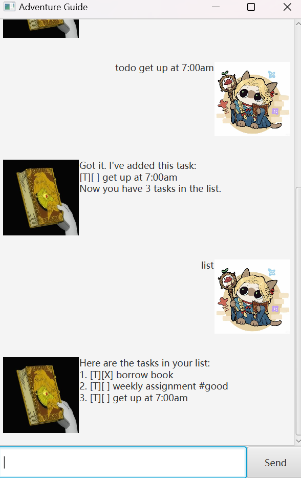

# Adventure Guide User Guide



> "Life is a great adventure, or it is nothing."  — John Dewey ([Source](https://www.mymountainsandme.com/blog/adventure-quotes))

Life is like an adventure, and the **Adventure Guide** is here to help you map out your journey and keep your goals in sight.

It's,
- text-based
	Interact with the bot using simple text commands.
- visualized
	Enjoy a visually appealing interface that enhances your user experience.
- easy to learn
	Get started quickly with intuitive commands and helpful prompts.
- ~~FAST~~ *SUPER FAST* to use
	Manage your tasks efficiently with quick and responsive interactions.

With Adventure Guide, you can keep your daily tasks organized in a ==fun and interactive== way. The bot provides responses in a chat format, just like a friend, making your task management more engaging and enjoyable.

## Adding deadlines

You can add deadline with text prompt in this format:
`deadline *task* /by *time*`
Please note that the time here should be in the format `dd/MM/yyyy HHmm`

**Example**
`deadline return book /by 16/2/2025 1800`

**Expected output**

```

Got it. I've added this task:
[D][] return book (by: Feb 16 2025 18:00)
Now you have 2 tasks in the list.

```

The output date will be in the format `MMM d yyyy HH:mm`

## Adding Events

You can add event with text prompt in this format:
`event *task* /from *time* /to *time`
Please note that the time here should be in the format `dd/MM/yyyy HHmm`

**Example**
`event project meeting /from 12/2/2025 1800 /to 13/2/2025 1800`

**Expected output**

Suggested there has already been 1 task in the task list.
```

Got it. I've added this task:
[E][] project meeting (from: Feb 12 2025 18:00 to: Feb 13 2025 18:00)
Now you have 3 tasks in the list.

```

The output date will be in the format `MMM d yyyy HH:mm`

## Adding todo

You can add todo with text prompt in this format:
`todo *task*`

**Example**
`todo borrow book`

**Expected output**

```

Got it. I've added this task:
[T][] borrow book
Now you have 4 tasks in the list.

```

## Listing tasks

You can have an overview of the list of your tasks with text prompt:
`list`

**Expected output**

```

Here are the tasks in your list:
1.[T][] weekly assignment
2.[D][] return book (by: Feb 16 2025 18:00)
3.[E][] project meeting (from: Feb 12 2025 18:00 to: Feb 13 2025 18:00)
4.[T][] borrow book

```


## Deleting task

You can delete a task with text prompt in this format:
`delete *task number*`

**Example**
`delete 1`

**Expected output**

```

Noted. I've removed this task:
[T][] weekly assignment
Now you have 3 tasks in the list.

```

## Marking & Unmarking task

You can mark a task as done or unmark a task with text prompt in these format respectively:
`mark *task number*`
`unmark *task number*`

**Example**
`mark 1`
`unmark 1`

**Expected output**
After marking task 1
```

Nice! I've marked this task as done:
[D][X] return book (by: Feb 16 2025 18:00)

```

After unmarking task 1
```
OK, I've marked this task as not done yet:
[D][] return book (by: Feb 16 2025 18:00)
```

## Tagging & Untagging task

You can tag a task or untag a task with text prompt in these format respectively:
`tag *task number* *tag*`
`untag *task number* *tag*`

**Example**
`tag 1 great`
`untag 1`

**Expected output**
After tagging task 1
```

A tag #great has been added to the task

```

After untagging task 1
```
The tag #great has been removed from the task.
```

## Finding a task

You can find a task with text prompt in these format respectively:
`find *part of task name*`

**Example**
`find book`

**Expected output**
```

Here are the matching tasks in your list:
1. [T][] borrow book

```
